# tx-guard 🛡️

**Check a crypto transaction before you sign it.**



**[▶ Try it live in your browser](https://txguard-jeffrey.streamlit.app)**, no install needed.

Most crypto theft doesn't come from "hacking the blockchain." It comes from people signing a transaction they don't understand: an unlimited token approval, an NFT "approve all," or a payment to a known scam address. Once signed, it can't be undone.

`tx-guard` reads a transaction or address and tells you in plain English what it will do and whether it's dangerous.

```
$ python -m txguard tx --to 0xA0b8...eB48 --data 0x095ea7b3...ffff

  🚨 DANGER   UNLIMITED approval: 0x1111... could take ALL of this token from your wallet, at any time, forever.

  Verdict: 🚨 DO NOT SIGN. This looks dangerous.
```

## What it checks

| Check | Why it matters |
|---|---|
| Known scam addresses | Matches against the [ScamSniffer](https://github.com/scamsniffer/scam-database) blocklist (~2,500 addresses, refreshed daily) |
| Unlimited `approve` / `increaseAllowance` | The #1 way wallets get drained: the spender can take every token, forever |
| NFT `setApprovalForAll` | Hands over every NFT in a collection |
| `permit` signatures | "Gasless" approvals that phishing sites love because they look like a harmless signature |
| Unverified contracts | If the code isn't public, nobody can see what it does |
| Brand-new addresses | Scam addresses are usually days old |
| Unknown functions | If it can't be explained, it gets flagged |

Every address inside the transaction (destination, spender, recipient) gets checked, not just the one you're sending to.

## Transaction simulation

Add `--from <your wallet>` and tx-guard dry-runs the transaction against the live chain (via the standard `eth_simulateV1` RPC method) **before** you sign, then shows exactly what would happen:

```
  ℹ️  INFO     Simulated result: you LOSE 500 USDC.
  ⚠️  WARNING  You give up assets and get NOTHING back. Fake 'claim' and 'mint' sites work exactly like this.
  🚨 DANGER   HIDDEN unlimited approval: 0xbbbb… could take ALL your USDC.
```

| Simulation check | Why it matters |
|---|---|
| Real token amounts in, out | "You lose 500 USDC" instead of raw calldata |
| Assets out, nothing back | The signature move of fake airdrop, claim and mint sites |
| Hidden approvals | Catches approvals buried inside multicalls or unknown functions that decoding alone can't see |
| Would-fail detection | Warns before you pay gas for a transaction that will revert |

Simulation uses a free public node by default. If it doesn't support `eth_simulateV1`, point it at another one:

```bash
export RPC_URL=https://eth-mainnet.g.alchemy.com/v2/YOUR_KEY
```

## Install

Requires Python 3.9+. No third-party packages.

```bash
git clone https://github.com/jeffreyesdavid/tx-guard.git
cd tx-guard
```

For the on-chain checks (contract verification, address age), get a free API key at [etherscan.io/myapikey](https://etherscan.io/myapikey):

```bash
export ETHERSCAN_API_KEY=your_key_here
```

Without a key, it still runs the scam-list and transaction-decoding checks.

## Web demo

Prefer a browser? There's a simple web version in `app.py`:

```bash
pip install -r requirements.txt
streamlit run app.py
```

Pick an example (or paste your own transaction) and click **Check**.

## Usage

```bash
# Check an address
python -m txguard address 0x101ce0cedd142f199c9ef61739ae59b6611a0fc0

# Check a transaction before signing (copy "to" and "data" from your wallet's details view)
python -m txguard tx --to 0xTOKEN --data 0x095ea7b3...

# Same, plus simulate what you'd gain or lose
python -m txguard tx --from 0xYOUR_WALLET --to 0xTOKEN --data 0x095ea7b3...

# Check an existing transaction by hash
python -m txguard hash 0xTX_HASH

# Use the Sepolia test network
python -m txguard --chain sepolia address 0x...

# Skip Etherscan entirely
python -m txguard --offline address 0x...
```

Exit codes: `0` = OK, `1` = warning, `2` = danger, so it can be used in scripts.

## Tests

```bash
python -m unittest discover -s tests -t .
```

35 tests, fully offline (Etherscan and the blockchain node are replaced with fakes).

## Project layout

```
txguard/
  decoder.py   # turns raw calldata into function + arguments
  checks.py    # the safety rules (pure logic, easy to test)
  simulate.py  # dry-runs a transaction on the live chain
  sources.py   # scam list + Etherscan API
  cli.py       # command line interface
tests/
  test_checks.py
```

## Roadmap

- [x] Scam list, approval detection, contract and age checks
- [x] Transaction simulation: exact balance changes, hidden approvals, would-fail detection
- [x] Human-readable token amounts (e.g. "500 USDC" instead of raw units)
- [ ] Browser extension that runs the checks automatically before your wallet signs
- [ ] "Undo window" vault: a smart contract that delays large transfers so you can cancel fraud

## Disclaimer

A clean result is not a guarantee of safety. This tool catches common, known patterns. Always verify before signing.

## License

MIT
